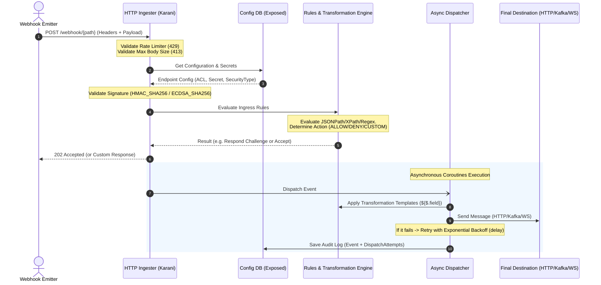
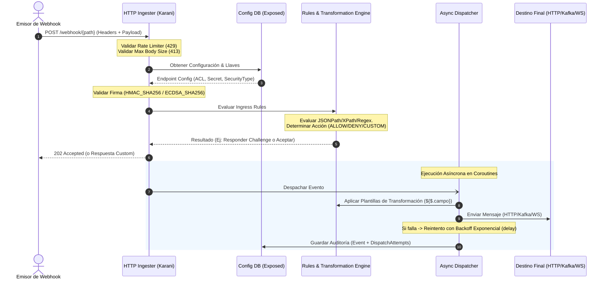

# 🦅 Karani Webhook Orchestrator

Choose your language / Selecciona tu idioma:

---

<details>
<summary>🇺🇸 <b>English Version (Click to expand)</b></summary>

## Description
**Karani** is a high-performance, ultra-resilient Webhook orchestration, routing, and transformation engine designed in Kotlin and built on Ktor. It allows you to ingest payloads, validate their cryptographic authenticity in real-time, apply dynamic filters (Ingress Rules), re-map structures (Payload Transformation), and dispatch them in parallel to multiple destinations (HTTP, Kafka, gRPC, WebSockets) with advanced retry policies.

---

### 🏗️ Architecture and Data Flow



---

### ⚡ Key Features

1. **Dynamic Configuration (CRUD):** Live registration and modification of endpoints, routing rules, and destinations via a REST API protected by API Key.
2. **Perimeter Protection and Resilience:**
   * **Rate Limiting:** Configurable Requests Per Minute (RPM) limits with rolling window to mitigate spammers.
   * **Payload Size Limit:** Restricts maximum body size (preventing Out-Of-Memory memory attacks).
3. **Advanced Security Layer:**
   * Dynamic handshakes and cryptographic signatures (`HMAC-SHA256`, `ECDSA-SHA256` with AES database decryption resolver).
4. **Filtering and Transformation Rules:**
   * Intelligent routing to specific destinations based on expressions (JSONPath, XPath, Regex).
   * Structure remapping via dynamic transformation templates (e.g., `{"id": "${$.order.id}"}`).
5. **Operational Fault Tolerance:**
   * Automatic retries configurable per destination with **Exponential Backoff** policies.
   * Complete audit logs and attempts details for fast debugging.

---

### 🚀 Quick Start Guide (Step by Step)

#### 1. Create a Dynamic Endpoint with Rate Limits
Register a new endpoint that accepts a maximum of 10 KB per payload and limits requests to 60 per minute.

```bash
curl -X POST http://localhost:8080/api/v1/config/endpoints \
  -H "Content-Type: application/json" \
  -H "X-API-Key: your-super-admin-token" \
  -d '{
    "name": "Stripe Gateway",
    "path": "v1/stripe/payments",
    "enabled": true,
    "persistEvents": true,
    "defaultAction": "ALLOW",
    "securityType": "NONE",
    "rateLimitRpm": 60,
    "maxBodySizeBytes": 10240
  }'
```
*Response:*
```json
{
  "status": "created",
  "id": "e2a6d71b-3f2c-49a8-9d7a-8f1b2c3d4e5f"
}
```

#### 2. Register a Handshake Rule (Custom Response)
Configure a rule to respond dynamically to `GET` authentication challenges (e.g., the `challenge` query parameter sent by Slack or Facebook).

```bash
curl -X POST http://localhost:8080/api/v1/config/endpoints/e2a6d71b-3f2c-49a8-9d7a-8f1b2c3d4e5f/rules \
  -H "Content-Type: application/json" \
  -H "X-API-Key: your-super-admin-token" \
  -d '{
    "priority": 1,
    "source": "HEADER",
    "expression": "query:challenge",
    "operator": "EXISTS",
    "action": "CUSTOM",
    "customResponse": {
      "statusCode": 200,
      "headers": {
        "Content-Type": "text/plain"
      },
      "bodyTemplate": "${query:challenge}"
    }
  }'
```

#### 3. Register a Destination with Backoff Retry
Add an HTTP destination. If it fails, Karani will retry the delivery up to 3 times waiting 1s on the first failure, then 2s, and finally 4s exponentially.

```bash
curl -X POST http://localhost:8080/api/v1/config/endpoints/e2a6d71b-3f2c-49a8-9d7a-8f1b2c3d4e5f/destinations \
  -H "Content-Type: application/json" \
  -H "X-API-Key: your-super-admin-token" \
  -d '{
    "name": "Central Server Backend",
    "type": "HTTP",
    "enabled": true,
    "settings": {
      "url": "https://api.mycompany.com/v1/receiver",
      "retryCount": "3",
      "retryIntervalMs": "1000",
      "retryBackoffMultiplier": "2.0"
    },
    "transformationTemplate": "{\"event_id\": \"${$.id}\", \"amount\": \"${$.data.amount}\"}"
  }'
```

#### 4. Receive the Webhook and Transform the Payload
Send a simulated webhook to the newly configured endpoint:

```bash
curl -X POST http://localhost:8080/webhook/v1/stripe/payments \
  -H "Content-Type: application/json" \
  -d '{
    "id": "evt_998877",
    "data": {
      "amount": "150.00"
    }
  }'
```
*Client response:* `202 Accepted`

*Transformed Async Dispatch:*
The receiver API (`mycompany.com/v1/receiver`) will asynchronously receive the transformed payload:
```json
{
  "event_id": "evt_998877",
  "amount": "150.00"
}
```

#### 5. Consult Audit Logs and Attempts
Query the status and full retry logs of a webhook using the event ID.

```bash
curl -X GET http://localhost:8080/api/v1/events/evt_998877 \
  -H "X-API-Key: your-super-admin-token"
```
*Response:*
```json
{
  "id": "evt_998877",
  "endpointId": "e2a6d71b-3f2c-49a8-9d7a-8f1b2c3d4e5f",
  "status": "SUCCESS",
  "receivedAt": "2026-08-14T20:10:05Z",
  "contentType": "application/json",
  "payload": {"id": "evt_998877", "data": {"amount": "150.00"}},
  "attempts": [
    {
      "id": "att_001",
      "destinationId": "dest-1",
      "status": "FAILED",
      "attemptNumber": 1,
      "responseStatusCode": 503,
      "errorMessage": "Service Unavailable",
      "executedAt": "2026-08-14T20:10:06Z"
    },
    {
      "id": "att_002",
      "destinationId": "dest-1",
      "status": "SUCCESS",
      "attemptNumber": 2,
      "responseStatusCode": 200,
      "errorMessage": null,
      "executedAt": "2026-08-14T20:10:08Z"
    }
  ]
}
```

---

### 🛠️ Execution and Deployment

#### Local (Gradle)
```bash
# Run unit and integration tests
./gradlew test

# Run the server locally
./gradlew run
```

#### Docker and Docker Compose (Production)
Build the optimized multi-stage production image:
```bash
docker build -t karani-orc:latest -f docker/Dockerfile .
```

Launch the stack with a PostgreSQL database:
```bash
cd docker
docker-compose up -d
```

</details>

<details>
<summary>🇪🇸 <b>Versión en Español (Click para expandir)</b></summary>

## Descripción
**Karani** es un motor de orquestación, enrutamiento y transformación de Webhooks de alto rendimiento y ultra-resiliente, diseñado en Kotlin y construido sobre Ktor. Permite recibir cargas útiles (payloads), validar su autenticidad criptográfica en tiempo de ejecución, aplicar filtros dinámicos (Ingress Rules), re-mapear estructuras (Payload Transformation) y despacharlos en paralelo hacia múltiples destinos (HTTP, Kafka, gRPC, WebSockets) con políticas avanzadas de reintento.

---

### 🏗️ Arquitectura y Flujo de Datos



---

### ⚡ Características Clave

1. **Configuración Dinámica Completa (CRUD):** Registro y modificación en caliente de endpoints, reglas de enrutamiento y destinos mediante una API REST protegida por API Key.
2. **Protección Perimetral y Resiliencia:**
   * **Rate Limiting:** Límite configurable de peticiones por minuto (RPM) con ventana móvil para mitigar spammers.
   * **Payload Size Limit:** Restringe el tamaño máximo del body (evitando ataques de desbordamiento de memoria `OOM`).
3. **Capa de Seguridad Avanzada:**
   * Handshakes dinámicos y firmas criptográficas (`HMAC-SHA256`, `ECDSA-SHA256` con resolución AES de secretos).
4. **Reglas de Filtrado y Transformación:**
   * Enrutamiento inteligente a destinos específicos basado en expresiones (JSONPath, XPath, Regex).
   * Remapeo de estructuras mediante plantillas de transformación dinámicas (ej: `{"id": "${$.order.id}"}`).
5. **Tolerancia a Fallos Operativos:**
   * Reintentos automáticos configurables por destino con políticas de **Backoff Exponencial**.
   * Registro completo de auditoría y detalles de intentos para depuración rápida.

---

### 🚀 Guía de Uso Rápido (Paso a Paso)

#### 1. Crear un Endpoint Dinámico con Límites de Tasa
Registra un nuevo endpoint que acepte máximo 10 KB por payload y limite las peticiones a un máximo de 60 por minuto.

```bash
curl -X POST http://localhost:8080/api/v1/config/endpoints \
  -H "Content-Type: application/json" \
  -H "X-API-Key: tu-super-token-de-admin" \
  -d '{
    "name": "Pasarela Stripe",
    "path": "v1/stripe/payments",
    "enabled": true,
    "persistEvents": true,
    "defaultAction": "ALLOW",
    "securityType": "NONE",
    "rateLimitRpm": 60,
    "maxBodySizeBytes": 10240
  }'
```
*Respuesta:*
```json
{
  "status": "created",
  "id": "e2a6d71b-3f2c-49a8-9d7a-8f1b2c3d4e5f"
}
```

#### 2. Registrar una Regla de Handshake (Custom Response)
Configura una regla para responder dinámicamente a los desafíos de autenticación `GET` (por ejemplo, el parámetro de consulta `challenge` que envía Slack o Facebook).

```bash
curl -X POST http://localhost:8080/api/v1/config/endpoints/e2a6d71b-3f2c-49a8-9d7a-8f1b2c3d4e5f/rules \
  -H "Content-Type: application/json" \
  -H "X-API-Key: tu-super-token-de-admin" \
  -d '{
    "priority": 1,
    "source": "HEADER",
    "expression": "query:challenge",
    "operator": "EXISTS",
    "action": "CUSTOM",
    "customResponse": {
      "statusCode": 200,
      "headers": {
        "Content-Type": "text/plain"
      },
      "bodyTemplate": "${query:challenge}"
    }
  }'
```

#### 3. Registrar un Destino con Backoff de Reintento
Agrega un destino HTTP. Si el servidor destino devuelve un error, Karani reintentará el envío hasta 3 veces esperando 1s en el primer fallo, luego 2s y finalmente 4s de forma exponencial.

```bash
curl -X POST http://localhost:8080/api/v1/config/endpoints/e2a6d71b-3f2c-49a8-9d7a-8f1b2c3d4e5f/destinations \
  -H "Content-Type: application/json" \
  -H "X-API-Key: tu-super-token-de-admin" \
  -d '{
    "name": "Backend Servidor Central",
    "type": "HTTP",
    "enabled": true,
    "settings": {
      "url": "https://api.miempresa.com/v1/receiver",
      "retryCount": "3",
      "retryIntervalMs": "1000",
      "retryBackoffMultiplier": "2.0"
    },
    "transformationTemplate": "{\"evento_id\": \"${$.id}\", \"monto\": \"${$.data.amount}\"}"
  }'
```

#### 4. Recibir el Webhook y Transformar el Payload
Envía un webhook simulado al endpoint recién configurado:

```bash
curl -X POST http://localhost:8080/webhook/v1/stripe/payments \
  -H "Content-Type: application/json" \
  -d '{
    "id": "evt_998877",
    "data": {
      "amount": "150.00"
    }
  }'
```
*Respuesta inmediata al cliente:* `202 Accepted`

*Transformación y Envío Asíncrono:*
El backend receptor (`miempresa.com/v1/receiver`) recibirá de forma asíncrona la estructura mapeada:
```json
{
  "evento_id": "evt_998877",
  "monto": "150.00"
}
```

#### 5. Consultar Auditoría Detallada e Intentos
Consulta el estado de despacho y el historial detallado de reintentos de un webhook mediante su ID único devuelto en la ingesta.

```bash
curl -X GET http://localhost:8080/api/v1/events/evt_998877 \
  -H "X-API-Key: tu-super-token-de-admin"
```
*Respuesta:*
```json
{
  "id": "evt_998877",
  "endpointId": "e2a6d71b-3f2c-49a8-9d7a-8f1b2c3d4e5f",
  "status": "SUCCESS",
  "receivedAt": "2026-08-14T20:10:05Z",
  "contentType": "application/json",
  "payload": {"id": "evt_998877", "data": {"amount": "150.00"}},
  "attempts": [
    {
      "id": "att_001",
      "destinationId": "dest-1",
      "status": "FAILED",
      "attemptNumber": 1,
      "responseStatusCode": 503,
      "errorMessage": "Service Unavailable",
      "executedAt": "2026-08-14T20:10:06Z"
    },
    {
      "id": "att_002",
      "destinationId": "dest-1",
      "status": "SUCCESS",
      "attemptNumber": 2,
      "responseStatusCode": 200,
      "errorMessage": null,
      "executedAt": "2026-08-14T20:10:08Z"
    }
  ]
}
```

---

### 🛠️ Ejecución y Despliegue

#### Local (Gradle)
```bash
# Correr pruebas unitarias e integración
./gradlew test

# Levantar el servidor localmente
./gradlew run
```

#### Docker y Docker Compose (Producción)
Compilar la imagen de producción optimizada multi-stage:
```bash
docker build -t karani-orc:latest -f docker/Dockerfile .
```

Levantar el entorno completo orquestado con base de datos PostgreSQL:
```bash
cd docker
docker-compose up -d
```

</details>
